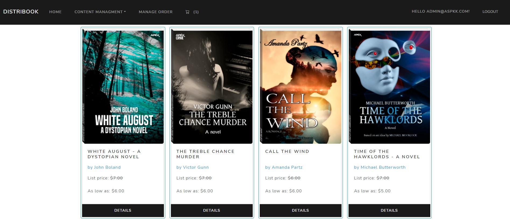

<div align = "center">

</div>

<p align="center">


</a>
</p>

# DistriBook

Web service for buying books, written in ASP.NET Core MVC to demonstrate my skills.

### Opportunities
- [x] Login.
- [x] Registration.
- [x] Collect order in cart.
- [x] Buy and pay with Stripe (disabled in demo).
- [x] Order status tracking.
- [x] Change order status.
- [x] Create new products
- [x] Create product categories.
- [x] Upload product image.
- [x] Select product category.
- [x] Select the type of product cover.

<hr/>

Веб сервис для покупки книг,написан на ASP.NET Core MVC с целью демонстрации моих навыков.

### Возможности
- [x] Вход.
- [x] Регистрация.
- [x] Сбор заказа в корзине.
- [x] Покупка и оплата через Stripe (отключена в демо версии).
- [x] Отслеживание статуса заказа.
- [x] Изменение статуса заказа.
- [x] Создание новых товаров
- [x] Создание категорий товаров.
- [x] Загрузка изображения товара.
- [x] Выбор категории товара.
- [x] Выбор типа обложки товара.

<hr/>

## DEMO

- URL

```url
https://distribook.azurewebsites.net/
```
<hr/>

- Administrator account

Login
```url
Admin@aspkk.com
```
Password
```url
Admin123*
```
<hr/>

- Customer account

Login
```url
Customer@aspkk.com
```
Password
```url
Admin123*
```
